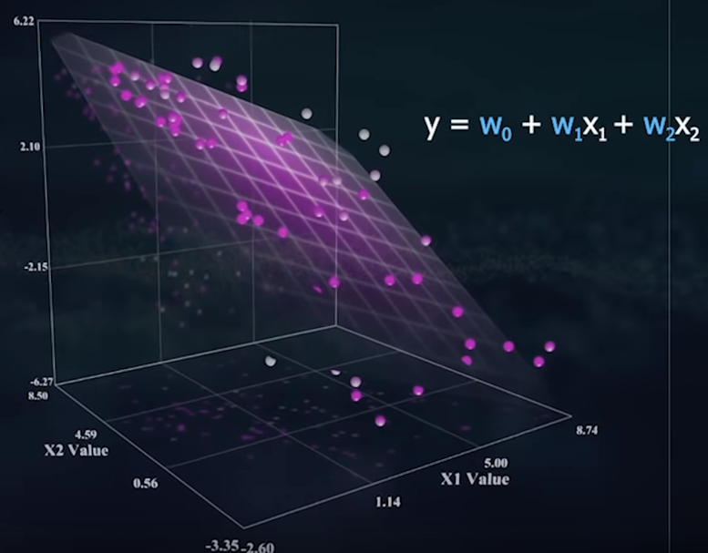
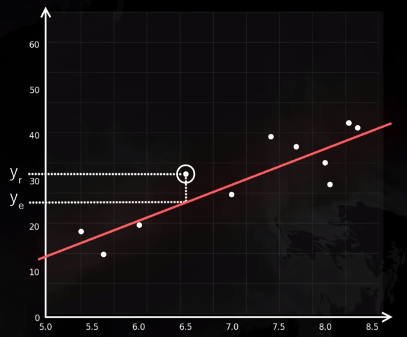
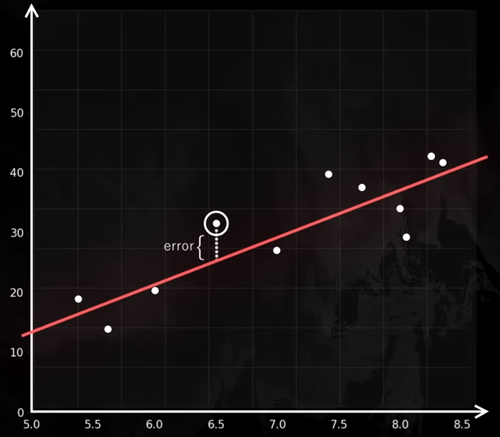
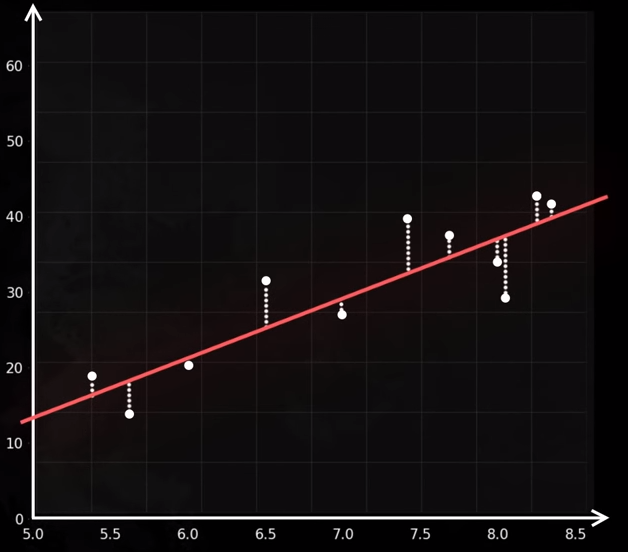

# Regresión Lineal y Mínimos Cuadrados Ordinarios

Dada una grafica, es creara una linea que se acerque lo mas posibles a todos los puntos de grafica.
A esto se le llamada <b>regresion lineal simple</b>

Este tipo de modelo, permite estipular el valor medio de un dato, sin tener los datos o los puntos 
excactos en la grafica.

Debemos de conocer la formula de esta regresion

      y = Wo + W1X

<b>Wo</b> :  Termino independeinte o la altura del eje <b>y</b>

<b>W1</b> :  Defina la inclinacion de la recta y por lo tanto la relacion entre la variable de entrada <b>X</b>
      y la vaiable de salida <b>y</b>

Esto sería la formula para una regresion simple con una sola variable de entrada 

Podemos tener varias variables de entrada para determinar el valor de salida.
De este modelo lo que buscamos ya no es encontrar la linea recta que se ajuntes a los datos
Lo que buscamos es el mejor plano que se ajuste a nuestros datos. 

Su formula sería así

    y = Wo + W1X1 + W2X2 + W3X3...
    
La forma mas comoda de representar todos estas variables de entrada es de forma vectorial
Es decir, si tenemos algo así:

    y1 = Wo + W1X11 + W2X12 + W3X13
    y2 = Wo + W1X21 + W2X22 + W3X23
    y3 = Wo + W1X31 + W2X32 + W3X33
    y4 = Wo + W1X41 + W2X42 + W3X43
    

Podemos crear una matriz donde cada columna representa una columna de nuestros datos de entrada

    
        <b>X11</b>   X12   X13
  X =   <b>X21</b>   X22   X23
        <b>X31</b>   X32   X33
        <b>X41</b>   X42   X43
    

Y cada Fila de la matriz representa cada una de las mediciones que podemos realizar con ella

    
        <b>X11</b>   <b>X12</b>   <b>X13</b>
        X21   X22   X23
  X =   X31   X32   X33
        X41   X42   X43
    
Tambien tenemos una serie de variable Y que tambine queremos modelar o predecir

        y1
        y2
 Y =    y3
        y4
     
Y tambine disponemos de una vector de parametros

  W  = [Wo  W1  W2  W3]

Con estos datos solo tenemos que usar una simple ecuación vectorias 

  Y = XW
 
 Lo que nos premite crear un modelo mas senciallo
 
 
 # Errores: Cuadrados ordinarios (metodo 1)
 
  ¿Como sabemo que hemos obtenido la mejor recta o el mejor plano?
 
  Para saber cual es la mejor recta, tenemos que tener en cuenta el error.
  
  

  
  En la grafica podemos ver <b>Yr</b> es el valor real y segun nuestro modelo o nuestra 
  linea de regresion el valor predicho es <b>Ye</b>
  
  Esta diferencia es el error:
  
  

  
  Pero no estamos trabajando con un unico punto, por lo que debemos de crear una funcion de coste o de error
  que reste los valores reales y los predichos de cada punto y generar la media.
  
    media(Yr - Ye)
   
  

    
   Para poder castigar mas los errores mas altos vamos a elevar al cuadrado el resultado
   
      media( (Yr - Ye)**2 )
      
  A esta funcion de coste se le denomina <b>Error de cuadratico medio</b>
  
  

  
  
  
# Errores: Descenso del gradiente (metodo 2)
  
  Otro metodo para calcular nuestro error y ajustar el modelo y que funciona 
  o se ajusta mejor que el calculo del cuadratico medio..
  
  En ellos esta basado las redes neuronales, que se verán en otro snippets
  
  
 

https://www.youtube.com/watch?v=k964_uNn3l0
