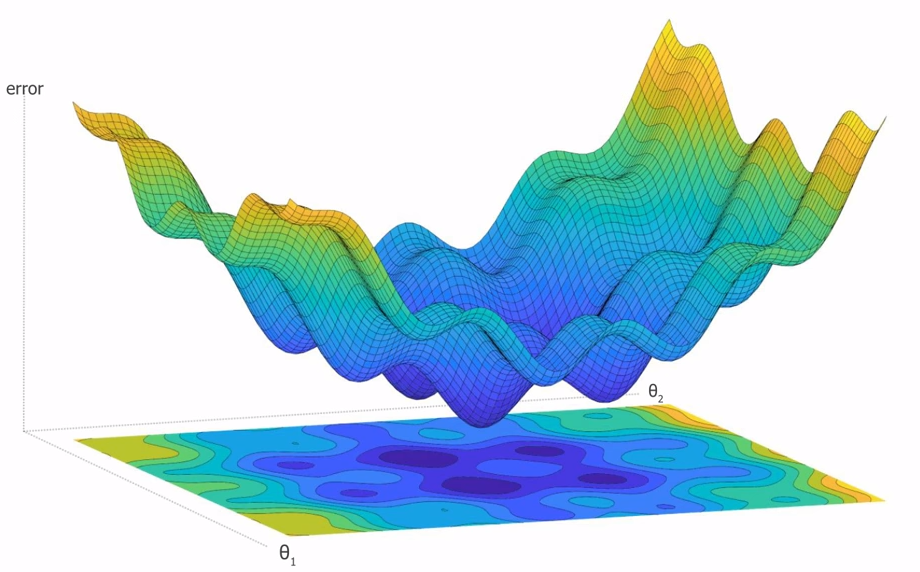

# Descenso del gradiente

Es un algoritmo de optimización clave dentro del campo de la inteligencia artificial.

Llamamos <b>funcion de coste</b> a la funcion que nos diga cual es el error para cada uno de nuestros parametros

Si derivamos una funcion, la funcion nos da la pendiente de dicho punto.

Por lo que en cada punto calculamos su derivada para conocer su pendiente, la evaluamos y avanzamos al siguiente punto.
Esta es la logica del descenso del gradiente.

Imaginamos que estamos en un punto cualquiera del grafico y tenemos que hayar el punto mas bajo o de menor error.

Calcularemos la deribada parcial para cada parameto, de cada uno de nuestras variables de entrada.
Esto nos devolvera el gradiente o direccion de la pendiente, pero la direccion de dicha pendiente siempre es positiva, 
por lo que la pasaremos a valor negativo para ir al siguiente punto, hasta encontrar el punto mas bajo o de menor error.

Aun nos falta indicar el <b>ratio de aprendidaje</b>, es decir cuanto avanzamos en cada paso, es la loingitud
del salto entre un punto y el siguiente. Si es corto tardaremos mucho y realizaremos muchas derivadas, si lo hacemos muy grandes,
puede que nos pasemos de largo, y tardemos tambien mucho en calcular este <b>ratio de aprendizaje</b>

Un problema que nos encontramos es ¿Como saber que realmente estamos en el punto mas bajo o error mas bajo? Este es una problema que podemos solventar tomando varios puentos aleatorios para calcular sobre cada uno de ellos el gradiente.
